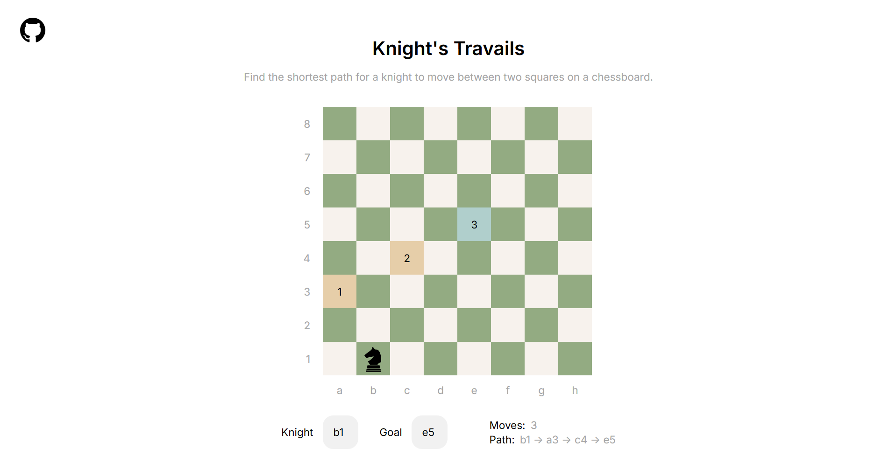

# Knight's Travails

The Odin Project - JavaScript Course Project 9:

A visual solution to TOP's Knight's Travails problem using BFS.

## Task

Given enough turns, a knight on a standard 8x8 chess board can move from any square to any other square. The goal is to traverse the graph (the chessboard) to find the shortest route between two nodes (the start and end positions).

## Preview

## Links

Live Link: https://luciavu.github.io/knights-travails/

Assignment: https://www.theodinproject.com/lessons/javascript-knights-travails

## Credits

GitHub icon from Fontello: https://fontello.com/

Chess Knight SVG by Dmitrii Lagunov from <a href="https://thenounproject.com/browse/icons/term/chess-knight/" target="_blank" title="chess knight Icons">Noun Project</a> (CC BY 3.0)
